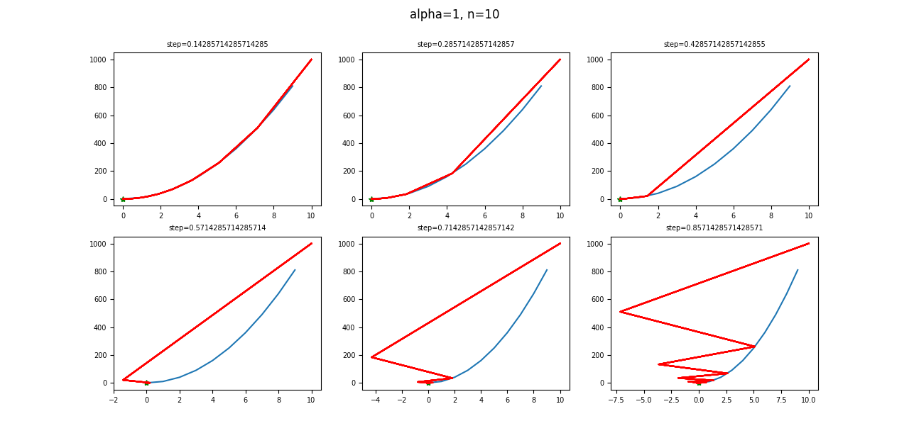
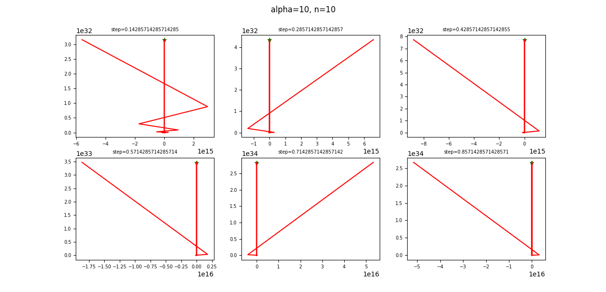
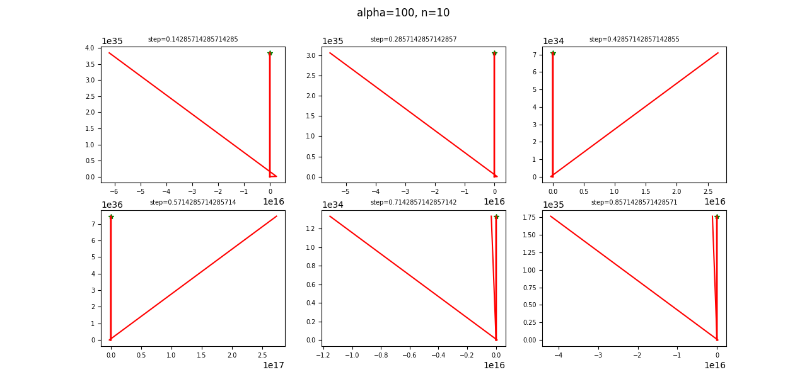
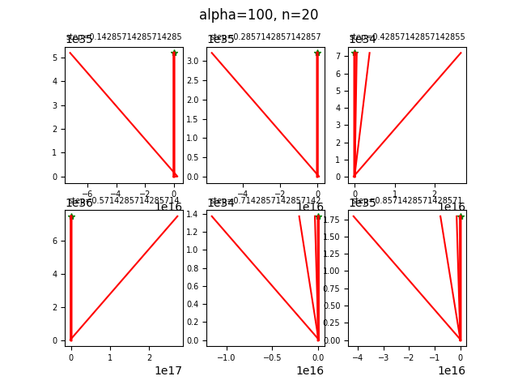
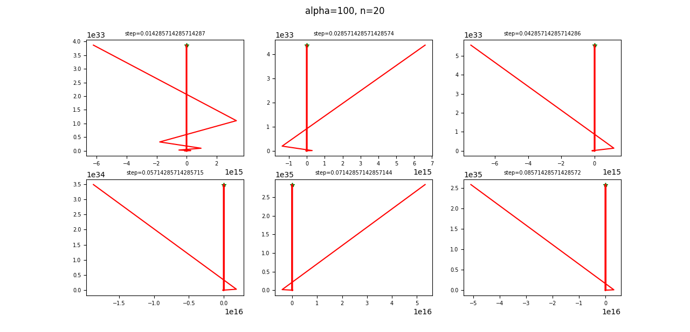
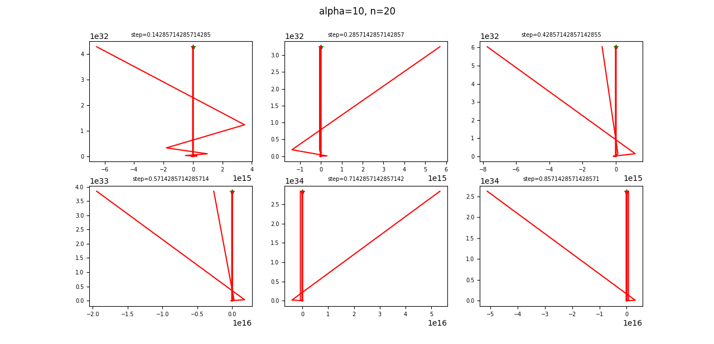
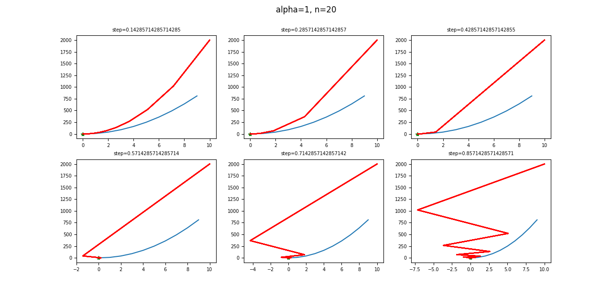

# Zadanie 1
Zaimplementuj algorytm gradientu prostego oraz algorytm Newtona. Algorytm Newtona powinien móc działać w dwóch trybach:
- ze stałym parametrem kroku
- z adaptacją parametru kroku przy użyciu metody z nawrotami.

Zbadaj wpływ wartości parametru kroku na zbieżność obu metod. Ponadto porównaj czasy działania obu algorytmów.

## Metoda gradientu prostego
1. Wpływ kroku na zbieżność\
Testowane wartości kroku:
```python
step = np.linspace(0, 1, 8)
```
\
Możemy zaobserwować, że optymalna wielkość kroku mieści się między 0.28 - 0.43.\
\
Najlepsze działanie dla kroku między 0.7 i 0.87.\
\
Wyniki dla większości wartości kroku są porównywalne, algorytm działa najlepiej dla wartości z przedziału [0.28, 0.57].\
\
Widzimy, że im mniejszy krok, tym lepsze wyniki, więc zbadajmy działanie dla przedziału [0, 0.1]:\
\
Najlepsza zbieżność dla kroku z przedziału [0.05, 0.07]\




## Porównanie czasów działania
```python
t_start = time.process_time()
localMinimum('gradientDescend', x0, f, 0.3, alpha[0], n[0])
t_stop = time.process_time()
print(f"gradient process time:{t_stop-t_start}")

t_start = time.process_time()
localMinimum('newtonConstStep', x0, f, 0.3, alpha[0], n[0])
t_stop = time.process_time()
print(f"newton with constant step process time:{t_stop-t_start}")

t_start = time.process_time()
localMinimum('newtonAdaptStep', x0, f, 0.3, alpha[0], n[0])
t_stop = time.process_time()
print(f"newton with backtracking process time:{t_stop-t_start}")
```
Gradient : 0.11456366700000009 s\
Newton bez nawrotów:\
Newton z nawrotami:\


