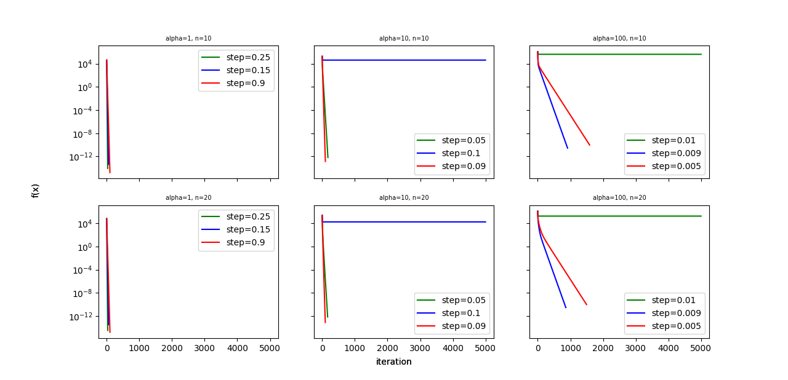
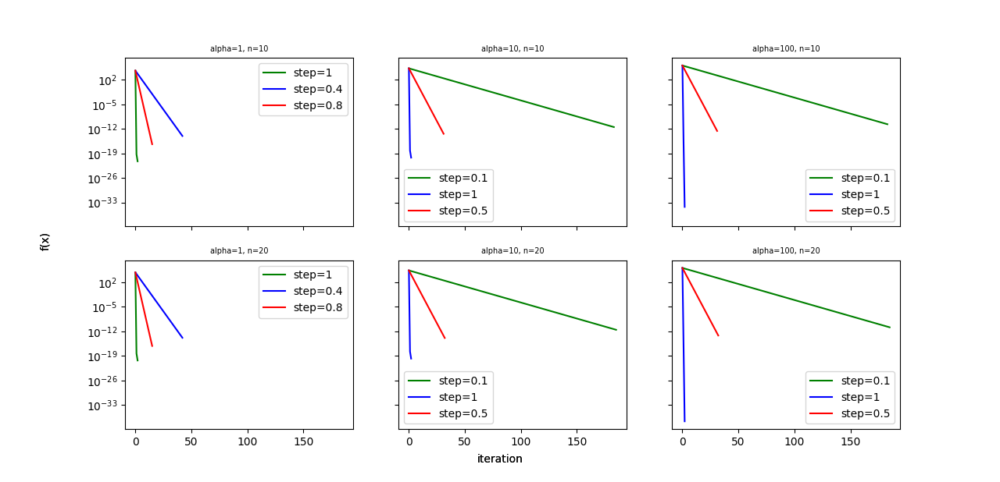

# Zadanie 1
Zaimplementuj algorytm gradientu prostego oraz algorytm Newtona. Algorytm Newtona powinien móc działać w dwóch trybach:
- ze stałym parametrem kroku
- z adaptacją parametru kroku przy użyciu metody z nawrotami.

Zbadaj wpływ wartości parametru kroku na zbieżność obu metod. Ponadto porównaj czasy działania obu algorytmów.

## Dobór kroku:
Aby zbadać, dla jakiego kroku algorytm działa najlepiej, przeprowadzam parę testów, porównując, w jaki sposób zmnieniają się wartości funkcji w następnych iteracjach w zależności od wartości kroku.
### Metoda gradientu prostego
\
Dla alpha = 1 algorytm szybko dąży do minimum fukcji dla każdego z testowanych wartości kroku. Najlepiej radzi sobie z wartością kroku równą 0.25.\
\
W przypadku alpha = 10 mniejsze wartości kroku działają lepiej, ponieważ wykres funkcji jest bardziej stromy, więc przy dużym parametrze kroku łatiej wpaść w oscylacje. Najlepiej algorytm radzi sobie przy kroku = 0.009 - mniejsze wartości powodują zbyt wolne dążenie do minimum, większe to, że algorytm "przeskakuje" miniumum.\
\
Dla alpha = 100, przy którym wykres jest jeszcze bardziej stromy, najbardziej optymalny jest jeszcze mniejszy parametr kroku. Tym razem to 0.009 daje najlepsze wyniki.\
\
### Metoda Newtona
\
Metoda Newtona przy każdej wartości alphy działa najlepiej dla kroku równego 1. Dla alpha = 1 metoda jest bardziej wybaczająca dobór kroku, przy większych wartościach niewłaściwy krok znacząco pogarsza działanie algorytmu.
### Metoda Newtona z nawrotami

Dodanie nawrotów nie zmienia znacząco zachowania algorytmu. Wciąż najlepiej działa krok = 1, zarówno mniejsze wartości, jak i większe powodują wzrost liczby iteracji.

\
Zmiana wymiarowości z n = 10 na n = 20 nie ma wpływu na ilość iteracji potrzebnych do znalezienia minimum funkcji.

## Czas działania

Pomiar czasu został wykonany dla najlepszych parametrów kroku dobranych przy analizie grafów. Poniższa tabela przedstawia czasu działania każdej z metod w sekundach oraz ilość iteracji przez nie wykonanych.

| Alpha | M. Gradientu prostego | M. Newtona | M. Newtona z nawrotami |
|---| ------------- |:-------------:| -----:|
|1| 0.15982819199999998, 31 | 0.6967977140000001, 2 | 1.350374592, 2 |
|10| 1.7953703810000015, 95 | 0.7039184420000026, 2 | 1.3920920089999989, 2|
|100|5.1365881999999985, 744 | 0.711913654, 2 | 1.4023558059999957, 2 |

Jak widać, dla alpha = 1 gradient działa najszybciej czasowo. Jest to spowodowane tym, że przy metodzie Newtona program musi wykonać więcej obliczeń - bardziej skomplikowany krok. Dodatkowo do wyliczenia hesjanu wykorzystuję bibliotekę `numdifftools`, przez co ta operacja jest bardzo kosztowna czasowo i nawet przy mniejszej ilości iteracji metoda zajmuje więcej czasu.\
\
Przewagę czasową Newtona możemy zaobserwować przy alpha = 10 lub 100. Przy bardziej stromych funkcjach, dzięki użyciu hesjanu, metoda Newtona znajduje minumum już po dwóch iteracjach, podczas gdy gradient potrzebuje ich prawie 100, w przypadku alpha = 10 i 744 w przypadku aplha = 100. Dzięki temu, nawet bardziej skomplikowane obliczenia są szybsze.\
\
Można wysnuć wnioski, że metoda Newtona jest lepsza od metody gradientu prostego, ponieważ praktycznie zawsze będzie potrzebowała mniejszej ilości iteracji do znalezienia minimum. Metoda gradientu prostego dla niektórych funkcji może być szybsza czasowo, ale w większości przypadków potrzebuje większej ilość iteracji, żeby znaleźć minimum, co może rezultować również dłużym czasem działania. \
\
Porównując metodę Newtona bez i z nawrotami ta druga wypada gorzej czasowo. Może być to spowodowane tym, że metoda bez nawrotów radzi sobie bardzo dobrze i już po 2 iteracjach znajduje minimum, więc metoda z nawrotami ma do wykonania więcej obliczeń bez zmniejszania ilości powtórzeń.
